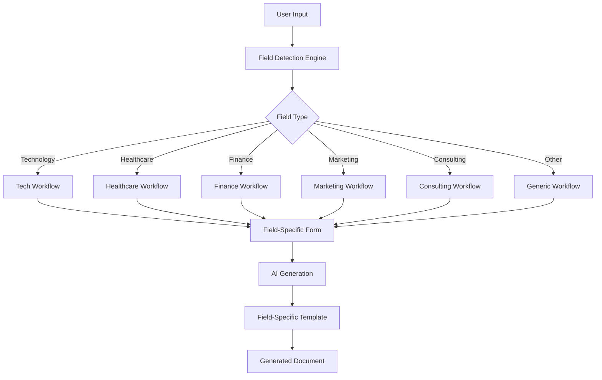
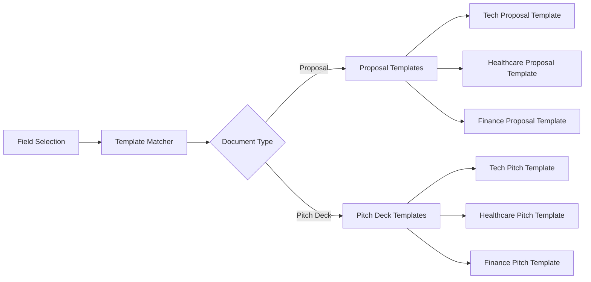

# AI-Powered Proposal and Pitch Deck Generator with Field-Specific Workflows

## Overview

This design enhances the existing PitchGenie application with intelligent field-specific workflows for AI-generated proposals and pitch decks. The system will detect the user's field of work and dynamically adapt the generation process, form fields, and output templates to match industry-specific requirements and best practices.

## Technology Stack & Dependencies

- **Frontend Framework**: Next.js 15.1.3 with App Router
- **Language**: TypeScript with React 19
- **AI Integration**: OpenRouter Free Models (Meta Llama 3.1 8B Instruct, Google Gemma 2 9B, Microsoft Phi-3 Mini) via AI SDK 4.0.0
- **Database**: Prisma ORM 5.7.0
- **Authentication**: NextAuth.js 4.24.10
- **UI Components**: Custom components with Tailwind CSS
- **Document Export**: jsPDF, docx, html2canvas, puppeteer

## Component Architecture

### Field Detection System



### Component Hierarchy

```
FieldSelectionComponent
├── FieldDetector
├── DynamicFormGenerator
│   ├── TechProposalForm
│   ├── HealthcareProposalForm
│   ├── FinanceProposalForm
│   ├── MarketingProposalForm
│   ├── ConsultingProposalForm
│   └── GenericProposalForm
├── AIWorkflowEngine
│   ├── FieldSpecificPrompts
│   ├── TemplateSelector
│   └── ContentGenerator
└── DocumentRenderer
    ├── ProposalRenderer
    └── PitchDeckRenderer
```

### Enhanced Field Selection Interface

**Component**: `FieldSelectionComponent`

```typescript
interface FieldConfiguration {
  id: string
  name: string
  description: string
  icon: string
  workflows: {
    proposal: ProposalWorkflow
    pitchDeck: PitchDeckWorkflow
  }
  formFields: FormFieldConfig[]
  templates: DocumentTemplate[]
}

interface ProposalWorkflow {
  sections: string[]
  requiredFields: string[]
  suggestedLength: number
  industryPrompts: string[]
}
```

**Supported Fields**:
- Technology & Software Development
- Healthcare & Medical Services
- Financial Services & Consulting
- Marketing & Digital Agencies
- Business Consulting
- Education & Training
- Real Estate
- Legal Services
- Creative & Design
- Manufacturing & Industrial

### Dynamic Form Generation

**Component**: `DynamicFormGenerator`

The form adapts based on selected field:

```typescript
interface FieldSpecificFormConfig {
  baseFields: FormField[]
  industryFields: FormField[]
  conditionalFields: ConditionalField[]
  validationRules: ValidationRule[]
}
```

## Field-Specific Workflows

### Technology & Software Development

**Proposal Sections**:
1. Technical Requirements Analysis
2. Solution Architecture
3. Development Methodology (Agile/Scrum)
4. Technology Stack Recommendations
5. Timeline & Milestones
6. Development Team Structure
7. Quality Assurance Process
8. Deployment & Maintenance
9. Security Considerations
10. Budget Breakdown

**Pitch Deck Sections**:
1. Problem & Market Gap
2. Technical Solution
3. Product Demo/MVP
4. Technology Competitive Advantage
5. Development Roadmap
6. Tech Team Expertise
7. Scalability Architecture
8. Market Validation & Metrics
9. Funding for R&D
10. Go-to-Market Strategy

**Form Fields**:
- Project complexity (Simple/Medium/Complex)
- Technology preferences
- Integration requirements
- Security compliance needs
- Scalability requirements
- Development methodology

### Healthcare & Medical Services

**Proposal Sections**:
1. Healthcare Compliance Overview
2. Patient Data Security (HIPAA)
3. Clinical Workflow Integration
4. Regulatory Requirements
5. Training & Implementation
6. Outcome Measurement
7. Risk Management
8. Compliance Monitoring
9. Support & Maintenance

**Pitch Deck Sections**:
1. Healthcare Problem
2. Clinical Solution
3. Regulatory Pathway
4. Clinical Validation
5. Healthcare Market Size
6. Reimbursement Strategy
7. Clinical Advisory Board
8. FDA/Regulatory Status
9. Healthcare Partnerships
10. Patient Impact Metrics

**Form Fields**:
- HIPAA compliance requirements
- Patient population served
- Clinical outcomes targeted
- Regulatory pathway
- Integration with EHR systems

### Financial Services & Consulting

**Proposal Sections**:
1. Financial Analysis Framework
2. Risk Assessment
3. Compliance Requirements
4. Investment Strategy
5. Performance Metrics
6. Reporting Structure
7. Regulatory Considerations
8. Market Analysis
9. Implementation Timeline

**Pitch Deck Sections**:
1. Market Opportunity
2. Financial Innovation
3. Regulatory Compliance
4. Revenue Model
5. Risk Management
6. Financial Projections
7. Investment Team
8. Competitive Analysis
9. Funding Requirements
10. Exit Strategy

### Marketing & Digital Agencies

**Proposal Sections**:
1. Brand Analysis
2. Target Audience Research
3. Marketing Strategy
4. Campaign Development
5. Channel Selection
6. Content Strategy
7. Performance Metrics
8. Budget Allocation
9. Timeline & Deliverables

**Pitch Deck Sections**:
1. Brand Challenge
2. Marketing Solution
3. Target Demographics
4. Campaign Strategy
5. Creative Concepts
6. Media Planning
7. Success Metrics
8. Case Studies
9. Team Expertise
10. ROI Projections

## AI Generation Engine

### OpenRouter Integration

**Free Models Configuration**:
```typescript
interface OpenRouterConfig {
  baseURL: string
  apiKey: string
  models: {
    primary: string    // 'meta-llama/llama-3.1-8b-instruct:free'
    fallback: string   // 'google/gemma-2-9b-it:free'
    lightweight: string // 'microsoft/phi-3-mini-128k-instruct:free'
  }
  maxTokens: number
  temperature: number
}

const openRouterConfig: OpenRouterConfig = {
  baseURL: 'https://openrouter.ai/api/v1',
  apiKey: process.env.OPENROUTER_API_KEY!,
  models: {
    primary: 'meta-llama/llama-3.1-8b-instruct:free',
    fallback: 'google/gemma-2-9b-it:free',
    lightweight: 'microsoft/phi-3-mini-128k-instruct:free'
  },
  maxTokens: 4000,
  temperature: 0.7
}
```

**Model Selection Strategy**:
- **Primary Model**: Meta Llama 3.1 8B Instruct (best for comprehensive proposals)
- **Fallback Model**: Google Gemma 2 9B (alternative for complex requests)
- **Lightweight Model**: Microsoft Phi-3 Mini (for quick generations and summaries)

### Field-Specific Prompt Engineering

```typescript
interface FieldPromptConfig {
  basePrompt: string
  industryContext: string
  sectionPrompts: Record<string, string>
  tonalGuidelines: string
  formatInstructions: string
}
```

**Technology Field Prompt Example** (Optimized for Llama 3.1 8B):
```
You are a senior technical consultant creating professional software development proposals.

Context: Generate a technical proposal for a software development project
Industry Focus: Emphasize technical architecture, scalability, security, and modern development practices
Tone: Professional, technically precise, solution-oriented, confident
Format: Use clear headings, technical specifications, and implementation details

Instructions:
1. Structure the proposal with clear sections
2. Include specific technology recommendations
3. Provide detailed implementation timelines
4. Address security and scalability considerations
5. Use technical terminology appropriately
6. Keep responses focused and actionable
```

**Healthcare Field Prompt Example** (Optimized for Gemma 2 9B):
```
You are a healthcare industry expert creating compliant medical service proposals.

Context: Generate a healthcare service proposal
Industry Focus: Emphasize patient outcomes, regulatory compliance, clinical evidence, and safety protocols
Tone: Professional, empathetic, evidence-based, authoritative
Format: Include clinical evidence, compliance frameworks, patient impact metrics

Instructions:
1. Prioritize patient safety and outcomes
2. Include relevant regulatory considerations (HIPAA, FDA)
3. Reference clinical evidence and best practices
4. Address compliance and risk management
5. Use appropriate medical terminology
6. Structure with clear medical service deliverables
```

### Template Selection Logic



## Document Examples

### Technology Proposal Sample Structure

```
# Software Development Proposal for [Client]

## Executive Summary
- Project overview with technical focus
- Key technical challenges addressed
- Proposed technology stack
- Expected technical outcomes

## Technical Requirements Analysis
- System architecture requirements
- Performance specifications
- Integration needs
- Security requirements

## Proposed Solution Architecture
- High-level system design
- Technology stack rationale
- Scalability considerations
- Security implementation

## Development Methodology
- Agile/Scrum process
- Sprint planning approach
- Code review procedures
- Testing methodology

## Project Timeline & Milestones
- Development phases
- Key deliverables
- Testing phases
- Deployment schedule

## Team Structure & Expertise
- Technical leads
- Developer team composition
- DevOps specialists
- QA team structure

## Quality Assurance Process
- Testing strategies
- Code quality standards
- Performance testing
- Security testing

## Investment & Technical ROI
- Development costs breakdown
- Infrastructure costs
- Maintenance projections
- Technical debt mitigation
```

### Healthcare Pitch Deck Sample Structure

```
Slide 1: Healthcare Challenge
- Patient problem definition
- Clinical impact statistics
- Current treatment limitations

Slide 2: Clinical Solution
- Medical innovation overview
- Treatment mechanism
- Patient benefit proposition

Slide 3: Clinical Evidence
- Research backing
- Pilot study results
- Clinical trial data

Slide 4: Regulatory Pathway
- FDA approval strategy
- Compliance framework
- Timeline to market

Slide 5: Healthcare Market
- Patient population size
- Market growth projections
- Reimbursement landscape

Slide 6: Clinical Validation
- Key opinion leader endorsements
- Hospital partnerships
- Patient testimonials

Slide 7: Medical Team
- Clinical advisory board
- Medical device experience
- Regulatory expertise

Slide 8: Go-to-Market Strategy
- Healthcare channel strategy
- Physician adoption plan
- Patient access program

Slide 9: Financial Projections
- Revenue per patient
- Market penetration
- Reimbursement rates

Slide 10: Funding for Impact
- Development milestones
- Clinical trial funding
- Regulatory approval costs
```

## API Endpoints Reference

### Enhanced Generation Endpoints

**POST** `/api/generate/proposal`
```typescript
interface ProposalGenerationRequest {
  field: string
  documentType: 'proposal' | 'pitch-deck'
  clientInfo: ClientInformation
  projectDetails: ProjectDetails
  fieldSpecificData: FieldSpecificFormData
  templatePreferences: TemplatePreferences
  modelPreference?: 'primary' | 'fallback' | 'lightweight'
}

interface OpenRouterGenerationResponse {
  content: string
  model: string
  tokensUsed: number
  generationTime: number
  success: boolean
}
```

**POST** `/api/generate/pitch-deck`
```typescript
interface PitchDeckGenerationRequest {
  field: string
  companyInfo: CompanyInformation
  problemSolution: ProblemSolutionData
  marketInfo: MarketInformation
  fieldSpecificData: FieldSpecificFormData
  presentationStyle: PresentationStyle
  modelPreference?: 'primary' | 'fallback' | 'lightweight'
}
```

### Field Configuration Endpoint

**GET** `/api/fields/configuration`
```typescript
interface FieldConfigurationResponse {
  fields: FieldConfiguration[]
  defaultField: string
  customFieldOptions: CustomFieldOption[]
}
```

## Data Models & ORM Mapping

### Enhanced Document Models

```typescript
model GeneratedDocument {
  id          String   @id @default(cuid())
  userId      String
  type        DocumentType
  field       String
  title       String
  content     Json
  template    String
  status      DocumentStatus
  metadata    Json
  createdAt   DateTime @default(now())
  updatedAt   DateTime @updatedAt
  
  user        User     @relation(fields: [userId], references: [id])
  exports     DocumentExport[]
  
  @@map("generated_documents")
}

model FieldConfiguration {
  id          String   @id @default(cuid())
  name        String   @unique
  description String
  icon        String
  config      Json
  isActive    Boolean  @default(true)
  createdAt   DateTime @default(now())
  
  @@map("field_configurations")
}

model DocumentTemplate {
  id          String   @id @default(cuid())
  field       String
  type        DocumentType
  name        String
  structure   Json
  prompts     Json
  isDefault   Boolean  @default(false)
  
  @@map("document_templates")
}
```

## Business Logic Layer

### Field Detection Engine

```typescript
class FieldDetectionEngine {
  async detectField(projectDescription: string): Promise<string> {
    // AI-powered field detection based on project description
    // Return detected field or 'generic' if uncertain
  }
  
  async getFieldConfiguration(field: string): Promise<FieldConfiguration> {
    // Retrieve field-specific configuration
  }
  
  async validateFieldCompatibility(field: string, documentType: string): Promise<boolean> {
    // Ensure field supports the requested document type
  }
}
```

### Template Selection Service

```typescript
class TemplateSelectionService {
  async selectTemplate(field: string, documentType: string, preferences: TemplatePreferences): Promise<DocumentTemplate> {
    // Select appropriate template based on field and preferences
  }
  
  async customizeTemplate(template: DocumentTemplate, fieldData: FieldSpecificFormData): Promise<DocumentTemplate> {
    // Customize template based on specific field requirements
  }
}
```

### AI Content Generation Service

```typescript
class FieldSpecificContentGenerator {
  private openRouterConfig: OpenRouterConfig
  
  constructor() {
    this.openRouterConfig = {
      baseURL: 'https://openrouter.ai/api/v1',
      apiKey: process.env.OPENROUTER_API_KEY!,
      models: {
        primary: 'meta-llama/llama-3.1-8b-instruct:free',
        fallback: 'google/gemma-2-9b-it:free',
        lightweight: 'microsoft/phi-3-mini-128k-instruct:free'
      },
      maxTokens: 4000,
      temperature: 0.7
    }
  }

  async generateProposal(field: string, data: ProposalGenerationRequest): Promise<OpenRouterGenerationResponse> {
    const model = this.selectModel(data.modelPreference, 'proposal')
    const prompt = this.buildFieldSpecificPrompt(field, data, 'proposal')
    
    try {
      const response = await this.callOpenRouter(model, prompt)
      return {
        content: response.content,
        model: model,
        tokensUsed: response.usage.total_tokens,
        generationTime: response.generationTime,
        success: true
      }
    } catch (error) {
      // Fallback to alternative model if primary fails
      if (model === this.openRouterConfig.models.primary) {
        return this.generateProposal(field, { ...data, modelPreference: 'fallback' })
      }
      throw error
    }
  }
  
  async generatePitchDeck(field: string, data: PitchDeckGenerationRequest): Promise<OpenRouterGenerationResponse> {
    const model = this.selectModel(data.modelPreference, 'pitch-deck')
    const prompt = this.buildFieldSpecificPrompt(field, data, 'pitch-deck')
    
    try {
      const response = await this.callOpenRouter(model, prompt)
      return {
        content: response.content,
        model: model,
        tokensUsed: response.usage.total_tokens,
        generationTime: response.generationTime,
        success: true
      }
    } catch (error) {
      // Fallback to alternative model if primary fails
      if (model === this.openRouterConfig.models.primary) {
        return this.generatePitchDeck(field, { ...data, modelPreference: 'fallback' })
      }
      throw error
    }
  }
  
  private selectModel(preference?: string, documentType?: string): string {
    if (preference === 'lightweight') {
      return this.openRouterConfig.models.lightweight
    }
    if (preference === 'fallback') {
      return this.openRouterConfig.models.fallback
    }
    return this.openRouterConfig.models.primary
  }
  
  private async callOpenRouter(model: string, prompt: string): Promise<any> {
    const response = await fetch(`${this.openRouterConfig.baseURL}/chat/completions`, {
      method: 'POST',
      headers: {
        'Authorization': `Bearer ${this.openRouterConfig.apiKey}`,
        'Content-Type': 'application/json',
        'HTTP-Referer': process.env.NEXT_PUBLIC_APP_URL,
        'X-Title': 'PitchGenie AI Generator'
      },
      body: JSON.stringify({
        model: model,
        messages: [{
          role: 'user',
          content: prompt
        }],
        max_tokens: this.openRouterConfig.maxTokens,
        temperature: this.openRouterConfig.temperature
      })
    })
    
    if (!response.ok) {
      throw new Error(`OpenRouter API error: ${response.status} ${response.statusText}`)
    }
    
    return response.json()
  }
  
  private buildFieldSpecificPrompt(field: string, data: any, documentType: string): string {
    const fieldPrompts = this.getFieldPrompts(field)
    const basePrompt = documentType === 'proposal' 
      ? fieldPrompts.proposalPrompt 
      : fieldPrompts.pitchDeckPrompt
    
    return `${fieldPrompts.industryContext}\n\n${basePrompt}\n\nData: ${JSON.stringify(data)}\n\n${fieldPrompts.formatInstructions}`
  }
  
  private getFieldPrompts(field: string): FieldPromptConfig {
    // Enhanced field-specific prompts optimized for free models
    const prompts: Record<string, FieldPromptConfig> = {
      'technology': {
        industryContext: 'You are a senior technical consultant creating professional software development proposals.',
        proposalPrompt: 'Create a detailed technical proposal focusing on architecture, scalability, and implementation methodology.',
        pitchDeckPrompt: 'Create a compelling startup pitch deck emphasizing technical innovation and market opportunity.',
        formatInstructions: 'Use clear headings, bullet points, and professional language. Include specific technical details and implementation approaches.'
      },
      'healthcare': {
        industryContext: 'You are a healthcare industry expert creating compliant medical service proposals.',
        proposalPrompt: 'Create a comprehensive healthcare proposal emphasizing patient outcomes, regulatory compliance, and clinical evidence.',
        pitchDeckPrompt: 'Create a healthcare startup pitch deck focusing on clinical validation, regulatory pathway, and patient impact.',
        formatInstructions: 'Emphasize evidence-based approaches, compliance frameworks, and patient safety. Use medical terminology appropriately.'
      },
      // Add more field configurations...
    }
    
    return prompts[field] || prompts['generic']
  }
}
```

## Testing Strategy

### Unit Testing

**Form Component Tests**:
```typescript
describe('DynamicFormGenerator', () => {
  test('renders technology-specific fields', () => {
    // Test technology field form rendering
  })
  
  test('validates required industry fields', () => {
    // Test field-specific validation
  })
  
  test('adapts form based on field selection', () => {
    // Test dynamic form adaptation
  })
})
```

**AI Generation Tests** (OpenRouter Integration):
```typescript
describe('FieldSpecificContentGenerator with OpenRouter', () => {
  test('generates technology proposal with Llama 3.1 8B model', async () => {
    const generator = new FieldSpecificContentGenerator()
    const result = await generator.generateProposal('technology', mockTechData)
    
    expect(result.content).toContain('technical architecture')
    expect(result.model).toBe('meta-llama/llama-3.1-8b-instruct:free')
    expect(result.success).toBe(true)
  })
  
  test('falls back to Gemma 2 9B when primary model fails', async () => {
    const generator = new FieldSpecificContentGenerator()
    // Mock primary model failure
    jest.spyOn(generator, 'callOpenRouter')
      .mockRejectedValueOnce(new Error('Rate limit'))
      .mockResolvedValueOnce({ content: 'fallback content', usage: { total_tokens: 100 } })
    
    const result = await generator.generateProposal('healthcare', mockHealthcareData)
    expect(result.model).toBe('google/gemma-2-9b-it:free')
  })
  
  test('applies healthcare-specific prompts with Gemma model', async () => {
    const generator = new FieldSpecificContentGenerator()
    const result = await generator.generateProposal('healthcare', mockHealthcareData)
    
    expect(result.content).toContain('patient outcomes')
    expect(result.content).toContain('compliance')
  })
  
  test('tracks token usage and generation time', async () => {
    const generator = new FieldSpecificContentGenerator()
    const result = await generator.generateProposal('technology', mockTechData)
    
    expect(result.tokensUsed).toBeGreaterThan(0)
    expect(result.generationTime).toBeGreaterThan(0)
  })
  
  test('validates OpenRouter API configuration', () => {
    const generator = new FieldSpecificContentGenerator()
    expect(generator.openRouterConfig.baseURL).toBe('https://openrouter.ai/api/v1')
    expect(generator.openRouterConfig.models.primary).toBe('meta-llama/llama-3.1-8b-instruct:free')
  })
})
```

### Integration Testing

**Field Detection Workflow**:
```typescript
describe('Field Detection Integration', () => {
  test('detects field from project description', () => {
    // Test AI-powered field detection
  })
  
  test('loads appropriate form configuration', () => {
    // Test form configuration loading
  })
  
  test('generates document with field-specific template', () => {
    // Test end-to-end generation workflow
  })
})
```

**OpenRouter Integration Tests**:
```typescript
describe('OpenRouter Integration', () => {
  test('successfully connects to OpenRouter API', async () => {
    const response = await fetch('https://openrouter.ai/api/v1/models')
    expect(response.ok).toBe(true)
  })
  
  test('handles rate limiting gracefully', async () => {
    // Test rate limit handling and fallback logic
  })
  
  test('validates free model availability', async () => {
    const models = ['meta-llama/llama-3.1-8b-instruct:free', 'google/gemma-2-9b-it:free']
    // Test that free models are accessible
  })
  
  test('monitors token usage within limits', async () => {
    // Test token usage tracking for free tier
  })
})
```

### Component Testing

**User Workflow Tests**:
- Field selection accuracy
- Form adaptation responsiveness
- Document generation quality
- Template appropriateness
- Export functionality with field-specific formats


