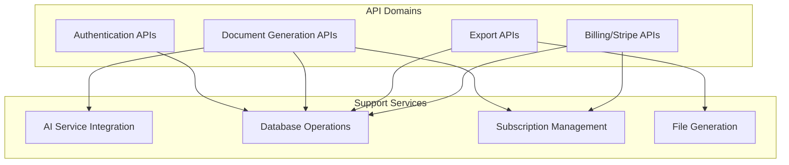
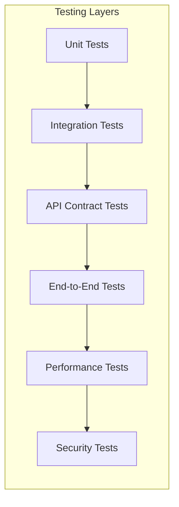
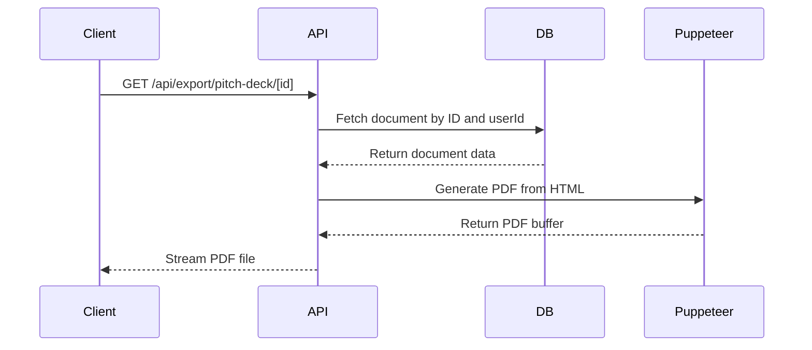
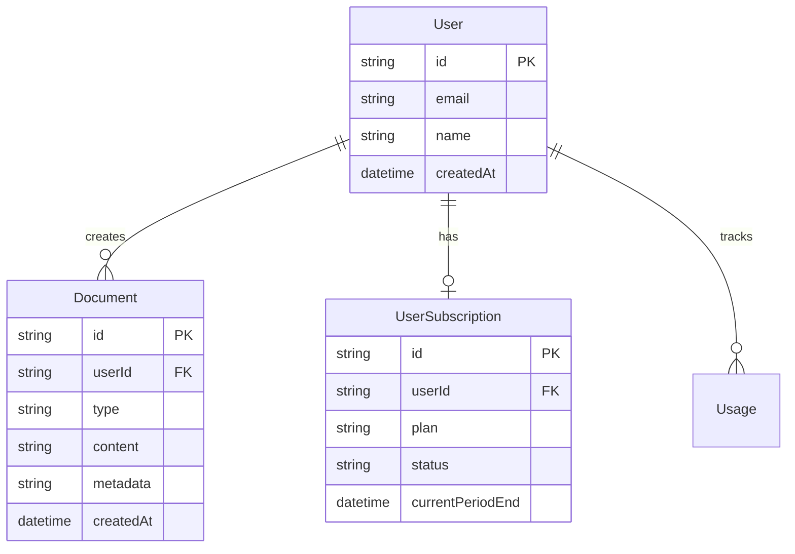
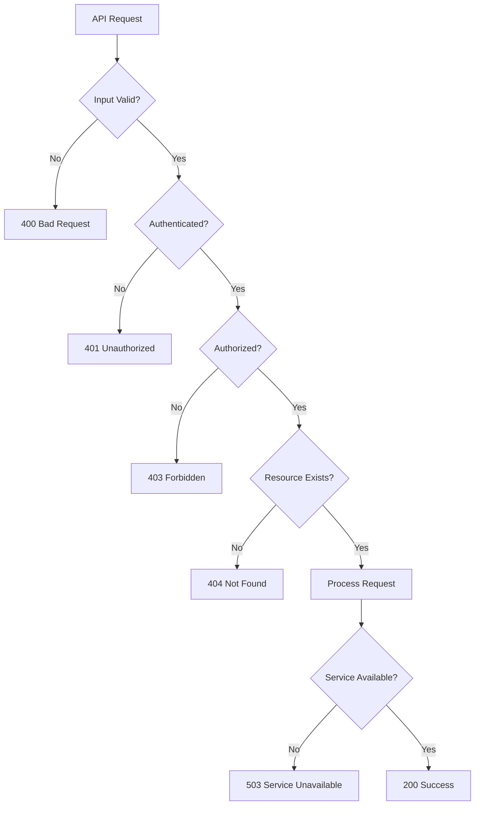
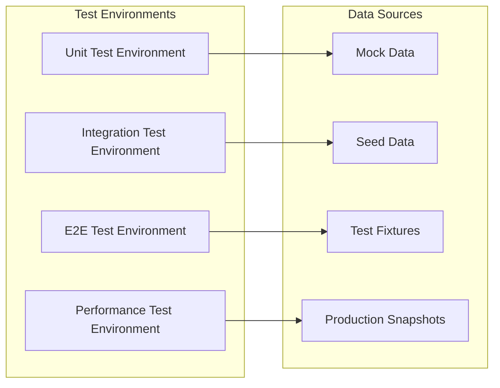

# API Testing and Validation Design

## Overview

This document outlines a comprehensive testing strategy for the PitchMe application to ensure all APIs are properly implemented, integrated, and production-ready. The testing approach covers functional validation, security verification, performance benchmarking, and integration testing across all major system components.

## Architecture Overview

The PitchMe application exposes a RESTful API architecture with the following core domains:



## API Endpoints Inventory

### Authentication Domain
- `GET/POST /api/auth/[...nextauth]` - NextAuth.js authentication handlers
- `POST /api/auth/register` - User registration

### Document Generation Domain  
- `POST /api/generate/pitch-deck` - AI-powered pitch deck generation
- `POST /api/generate/proposal` - AI-powered proposal generation

### Export Domain
- `GET /api/export/pitch-deck/[id]` - Export pitch deck as PDF
- `GET /api/export/proposal/[id]?format=pdf|docx` - Export proposal as PDF/DOCX

### Billing Domain
- `POST /api/stripe/create-checkout` - Create Stripe checkout session
- `POST /api/stripe/create-portal` - Create customer portal session
- `POST /api/stripe/webhook` - Handle Stripe webhook events

## Testing Framework Architecture



## Authentication API Testing

### Test Scenarios

| Test Case | Endpoint | Method | Expected Result | Priority |
|-----------|----------|--------|-----------------|----------|
| Valid login | `/api/auth/[...nextauth]` | POST | 200, session cookie | Critical |
| Invalid credentials | `/api/auth/[...nextauth]` | POST | 401 Unauthorized | Critical |
| Session validation | `/api/auth/[...nextauth]` | GET | Valid session data | Critical |
| User registration | `/api/auth/register` | POST | 201, user created | Critical |
| Duplicate registration | `/api/auth/register` | POST | 409 Conflict | High |

### Security Validation
- CSRF protection verification
- Session token expiration handling
- Password strength validation
- Rate limiting on login attempts
- Secure cookie configuration

### Test Implementation Pattern
```typescript
// Example test structure
describe('Authentication API', () => {
  test('should authenticate valid user', async () => {
    const response = await request(app)
      .post('/api/auth/signin')
      .send({ email: 'test@example.com', password: 'validPassword' })
    
    expect(response.status).toBe(200)
    expect(response.headers['set-cookie']).toBeDefined()
  })
})
```

## Document Generation API Testing

### Pitch Deck Generation Tests

| Test Case | Input Parameters | Expected Behavior | Validation Points |
|-----------|------------------|-------------------|-------------------|
| Valid generation request | Complete form data | 200, document ID returned | Content quality, metadata storage |
| Missing required fields | Incomplete data | 400 Bad Request | Field validation errors |
| Usage limit exceeded | Valid data, limit reached | 403 Forbidden | Subscription enforcement |
| AI service failure | Valid data, service down | 500 Internal Error | Error handling, fallback |
| Field-specific generation | Healthcare/Tech fields | 200, field-specific content | Content customization |

### Proposal Generation Tests

| Test Case | Input Parameters | Expected Behavior | Validation Points |
|-----------|------------------|-------------------|-------------------|
| Standard proposal | Complete proposal data | 200, document created | Content structure, AI integration |
| Custom field data | Field-specific parameters | 200, customized content | Field adaptation logic |
| Large content generation | Maximum input size | 200 or timeout handling | Performance limits |
| Visual mode toggle | visualMode: true/false | Appropriate model selection | Model routing logic |

### Content Quality Validation
- Generated content completeness
- Field-specific customization accuracy
- Metadata tracking verification
- Token usage recording
- Generation time monitoring

## Export API Testing

### PDF Export Validation



| Test Case | Document Type | Format | Expected Result | Validation |
|-----------|---------------|--------|-----------------|------------|
| Valid pitch deck export | Existing document | PDF | File download | File integrity, headers |
| Valid proposal export | Existing document | PDF/DOCX | File download | Format correctness |
| Unauthorized access | Other user's document | Any | 404 Not Found | Access control |
| Non-existent document | Invalid ID | Any | 404 Not Found | Error handling |
| Corrupted document data | Malformed content | Any | 500 or graceful handling | Error recovery |

### File Generation Testing
- PDF rendering accuracy
- DOCX format compliance  
- File size optimization
- Browser compatibility
- Content disposition headers

## Stripe Integration Testing

### Checkout Flow Testing

| Test Case | Scenario | Expected Outcome | Validation Points |
|-----------|----------|------------------|-------------------|
| Valid checkout creation | Authenticated user, valid plan | Stripe session URL | Session metadata, pricing |
| Invalid plan selection | Non-existent plan | 400 Bad Request | Plan validation |
| Unauthenticated checkout | No session | 401 Unauthorized | Authentication check |
| Checkout completion | Successful payment | Subscription activation | Webhook processing |

### Webhook Event Testing

| Event Type | Test Scenario | Expected Database Update | Validation |
|------------|---------------|-------------------------|------------|
| `checkout.session.completed` | Payment success | User subscription created | Plan activation |
| `customer.subscription.updated` | Plan change | Subscription modified | Status sync |
| `customer.subscription.deleted` | Cancellation | Subscription ended | Access revocation |
| Invalid signature | Tampered payload | Request rejected | Security validation |

### Webhook Security Testing
- Signature verification accuracy
- Replay attack prevention
- Payload validation robustness
- Error response handling

## Database Integration Testing

### Data Consistency Validation



| Test Category | Validation Points | Test Methods |
|---------------|-------------------|--------------|
| Document Creation | User ownership, data integrity | Unit & integration tests |
| Subscription Management | Plan enforcement, usage tracking | Webhook simulation |
| Usage Limiting | Counter accuracy, reset logic | Boundary testing |
| Data Isolation | User access restrictions | Security testing |

## Performance Testing

### Load Testing Scenarios

| Endpoint | Load Pattern | Success Criteria | Performance Metrics |
|----------|-------------|------------------|-------------------|
| Document Generation | 10 concurrent users | <5s response time | Throughput, AI service limits |
| Document Export | 50 concurrent exports | <3s file generation | Memory usage, Puppeteer performance |
| Authentication | 100 login attempts/min | <1s response time | Database connection pooling |
| Webhook Processing | Burst events | <2s processing time | Queue handling, database writes |

### Resource Monitoring
- Memory usage during PDF generation
- Database connection utilization
- AI service rate limiting
- File system storage patterns

## Security Testing

### Authentication Security

| Security Aspect | Test Approach | Validation Criteria |
|-----------------|---------------|-------------------|
| Session Management | Token manipulation, expiration | Secure session handling |
| Password Security | Strength validation, hashing | BCrypt implementation |
| Rate Limiting | Brute force simulation | Login attempt blocking |
| CSRF Protection | Cross-site request testing | Token validation |

### API Security Testing

| Vulnerability | Test Method | Mitigation Verification |
|---------------|-------------|------------------------|
| SQL Injection | Malicious input testing | Prisma ORM protection |
| XSS Prevention | Script injection attempts | Input sanitization |
| Authorization Bypass | Access control testing | User isolation verification |
| Data Exposure | Information leakage testing | Response filtering |

### Input Validation Testing

| Input Type | Validation Tests | Security Measures |
|------------|------------------|-------------------|
| Form Data | Field validation, type checking | Server-side validation |
| File Uploads | Size limits, type restrictions | File type verification |
| Query Parameters | SQL injection, XSS | Parameterized queries |
| JSON Payloads | Schema validation, size limits | Request parsing limits |

## Error Handling Validation

### Error Response Testing



| Error Condition | Expected Response | Recovery Mechanism |
|-----------------|-------------------|-------------------|
| Database connection failure | 503 Service Unavailable | Connection retry logic |
| AI service timeout | 500 Internal Error | Fallback model selection |
| File generation failure | 500 Internal Error | Error logging, user notification |
| Rate limit exceeded | 429 Too Many Requests | Retry-after header |

## Integration Testing Strategy

### Service Integration Points

| Integration | Test Approach | Validation Criteria |
|-------------|---------------|-------------------|
| NextAuth.js | Authentication flow testing | Session management accuracy |
| Prisma ORM | Database operation testing | Data consistency, transaction handling |
| OpenRouter AI | Model integration testing | Response quality, error handling |
| Stripe API | Payment flow testing | Event processing accuracy |
| Puppeteer | PDF generation testing | File quality, resource cleanup |

### External Service Mocking

```typescript
// Example mock configuration
const mockAIService = {
  generatePitchDeck: jest.fn().mockResolvedValue({
    success: true,
    content: 'Generated content',
    model: 'test-model',
    tokensUsed: 1000
  })
}
```

## Monitoring and Observability

### Health Check Implementation

| Health Check | Endpoint | Validation | Alert Threshold |
|--------------|----------|------------|-----------------|
| Database connectivity | `/api/health/db` | Connection test | >2s response time |
| AI service availability | `/api/health/ai` | Model ping | >5s response time |
| Stripe connectivity | `/api/health/stripe` | API test | Service unreachable |
| File system status | `/api/health/storage` | Disk space check | >90% utilization |

### Performance Metrics

| Metric | Collection Method | Monitoring Tool | Alert Conditions |
|--------|-------------------|-----------------|------------------|
| API Response Times | Request instrumentation | Application logs | >95th percentile exceeds SLA |
| Error Rates | Error tracking | Monitoring dashboard | >1% error rate |
| Database Performance | Query monitoring | Database metrics | Slow query detection |
| Memory Usage | System monitoring | Infrastructure alerts | >80% memory utilization |

## Test Data Management

### Test Environment Setup



### Data Isolation Strategy

| Test Level | Data Strategy | Cleanup Approach |
|------------|---------------|------------------|
| Unit Tests | In-memory mocks | Automatic cleanup |
| Integration Tests | Dedicated test DB | Transaction rollback |
| E2E Tests | Isolated test data | Scheduled cleanup |
| Performance Tests | Production-like data | Snapshot restoration |

## Production Readiness Checklist

### Infrastructure Readiness

- [ ] Database migration scripts validated
- [ ] Environment variables configured
- [ ] SSL certificates installed
- [ ] Load balancer configuration tested
- [ ] CDN setup for static assets
- [ ] Backup and recovery procedures tested

### Security Compliance

- [ ] HTTPS enforcement verified
- [ ] Security headers implemented
- [ ] API rate limiting configured
- [ ] Input validation comprehensive
- [ ] Authentication flows secured
- [ ] Data encryption at rest

### Performance Optimization

- [ ] Database indexes optimized
- [ ] API response caching implemented
- [ ] Static asset optimization
- [ ] Bundle size optimization
- [ ] Database connection pooling
- [ ] Memory leak prevention

### Monitoring Setup

- [ ] Application performance monitoring
- [ ] Error tracking and alerting
- [ ] Business metrics tracking
- [ ] Infrastructure monitoring
- [ ] Log aggregation and analysis
- [ ] Uptime monitoring

## Testing Implementation Timeline

| Phase | Duration | Deliverables | Success Criteria |
|-------|----------|--------------|------------------|
| Unit Testing Setup | 1 week | Test framework, basic tests | >80% code coverage |
| Integration Testing | 1 week | API integration tests | All endpoints validated |
| Security Testing | 3 days | Security test suite | No critical vulnerabilities |
| Performance Testing | 3 days | Load test results | Performance SLAs met |
| E2E Testing | 1 week | Complete user journeys | All workflows functional |
| Production Validation | 2 days | Deployment verification | System operational |

## Risk Assessment and Mitigation

### High-Risk Areas

| Risk Area | Impact Level | Mitigation Strategy |
|-----------|-------------|-------------------|
| AI Service Dependency | High | Multiple model fallbacks, circuit breaker pattern |
| PDF Generation Memory | Medium | Resource limits, cleanup procedures |
| Database Connection Pool | High | Connection monitoring, auto-scaling |
| Stripe Webhook Processing | High | Idempotency, retry mechanisms |

### Failure Scenarios

| Failure Type | Detection Method | Recovery Procedure |
|--------------|------------------|-------------------|
| Database unavailable | Health check failure | Fallback to read replica |
| AI service timeout | Request timeout | Retry with different model |
| PDF generation failure | Process monitoring | Graceful error response |
| Payment processing error | Webhook validation | Manual reconciliation process || Session validation | `/api/auth/[...nextauth]` | GET | Valid session data | Critical |
| User registration | `/api/auth/register` | POST | 201, user created | Critical |
| Duplicate registration | `/api/auth/register` | POST | 409 Conflict | High |

### Security Validation
- CSRF protection verification
- Session token expiration handling
- Password strength validation
- Rate limiting on login attempts
- Secure cookie configuration

### Test Implementation Pattern
```typescript
// Example test structure
describe('Authentication API', () => {
  test('should authenticate valid user', async () => {
    const response = await request(app)
      .post('/api/auth/signin')
      .send({ email: 'test@example.com', password: 'validPassword' })
    
    expect(response.status).toBe(200)
    expect(response.headers['set-cookie']).toBeDefined()
  })
})
```

## Document Generation API Testing

### Pitch Deck Generation Tests

| Test Case | Input Parameters | Expected Behavior | Validation Points |
|-----------|------------------|-------------------|-------------------|
| Valid generation request | Complete form data | 200, document ID returned | Content quality, metadata storage |
| Missing required fields | Incomplete data | 400 Bad Request | Field validation errors |
| Usage limit exceeded | Valid data, limit reached | 403 Forbidden | Subscription enforcement |
| AI service failure | Valid data, service down | 500 Internal Error | Error handling, fallback |
| Field-specific generation | Healthcare/Tech fields | 200, field-specific content | Content customization |

### Proposal Generation Tests

| Test Case | Input Parameters | Expected Behavior | Validation Points |
|-----------|------------------|-------------------|-------------------|
| Standard proposal | Complete proposal data | 200, document created | Content structure, AI integration |
| Custom field data | Field-specific parameters | 200, customized content | Field adaptation logic |
| Large content generation | Maximum input size | 200 or timeout handling | Performance limits |
| Visual mode toggle | visualMode: true/false | Appropriate model selection | Model routing logic |

### Content Quality Validation
- Generated content completeness
- Field-specific customization accuracy
- Metadata tracking verification
- Token usage recording
- Generation time monitoring

## Export API Testing

### PDF Export Validation


| Test Case | Document Type | Format | Expected Result | Validation |
|-----------|---------------|--------|-----------------|------------|
| Valid pitch deck export | Existing document | PDF | File download | File integrity, headers |
| Valid proposal export | Existing document | PDF/DOCX | File download | Format correctness |
| Unauthorized access | Other user's document | Any | 404 Not Found | Access control |
| Non-existent document | Invalid ID | Any | 404 Not Found | Error handling |
| Corrupted document data | Malformed content | Any | 500 or graceful handling | Error recovery |

### File Generation Testing
- PDF rendering accuracy
- DOCX format compliance  
- File size optimization
- Browser compatibility
- Content disposition headers

## Stripe Integration Testing

### Checkout Flow Testing

| Test Case | Scenario | Expected Outcome | Validation Points |
|-----------|----------|------------------|-------------------|
| Valid checkout creation | Authenticated user, valid plan | Stripe session URL | Session metadata, pricing |
| Invalid plan selection | Non-existent plan | 400 Bad Request | Plan validation |
| Unauthenticated checkout | No session | 401 Unauthorized | Authentication check |
| Checkout completion | Successful payment | Subscription activation | Webhook processing |

### Webhook Event Testing

| Event Type | Test Scenario | Expected Database Update | Validation |
|------------|---------------|-------------------------|------------|
| `checkout.session.completed` | Payment success | User subscription created | Plan activation |
| `customer.subscription.updated` | Plan change | Subscription modified | Status sync |
| `customer.subscription.deleted` | Cancellation | Subscription ended | Access revocation |
| Invalid signature | Tampered payload | Request rejected | Security validation |

### Webhook Security Testing
- Signature verification accuracy
- Replay attack prevention
- Payload validation robustness
- Error response handling

## Database Integration Testing

### Data Consistency Validation


| Test Category | Validation Points | Test Methods |
|---------------|-------------------|--------------|
| Document Creation | User ownership, data integrity | Unit & integration tests |
| Subscription Management | Plan enforcement, usage tracking | Webhook simulation |
| Usage Limiting | Counter accuracy, reset logic | Boundary testing |
| Data Isolation | User access restrictions | Security testing |

## Performance Testing

### Load Testing Scenarios

| Endpoint | Load Pattern | Success Criteria | Performance Metrics |
|----------|-------------|------------------|-------------------|
| Document Generation | 10 concurrent users | <5s response time | Throughput, AI service limits |
| Document Export | 50 concurrent exports | <3s file generation | Memory usage, Puppeteer performance |
| Authentication | 100 login attempts/min | <1s response time | Database connection pooling |
| Webhook Processing | Burst events | <2s processing time | Queue handling, database writes |

### Resource Monitoring
- Memory usage during PDF generation
- Database connection utilization
- AI service rate limiting
- File system storage patterns

## Security Testing

### Authentication Security

| Security Aspect | Test Approach | Validation Criteria |
|-----------------|---------------|-------------------|
| Session Management | Token manipulation, expiration | Secure session handling |
| Password Security | Strength validation, hashing | BCrypt implementation |
| Rate Limiting | Brute force simulation | Login attempt blocking |
| CSRF Protection | Cross-site request testing | Token validation |

### API Security Testing

| Vulnerability | Test Method | Mitigation Verification |
|---------------|-------------|------------------------|
| SQL Injection | Malicious input testing | Prisma ORM protection |
| XSS Prevention | Script injection attempts | Input sanitization |
| Authorization Bypass | Access control testing | User isolation verification |
| Data Exposure | Information leakage testing | Response filtering |

### Input Validation Testing

| Input Type | Validation Tests | Security Measures |
|------------|------------------|-------------------|
| Form Data | Field validation, type checking | Server-side validation |
| File Uploads | Size limits, type restrictions | File type verification |
| Query Parameters | SQL injection, XSS | Parameterized queries |
| JSON Payloads | Schema validation, size limits | Request parsing limits |

## Error Handling Validation

### Error Response Testing


| Error Condition | Expected Response | Recovery Mechanism |
|-----------------|-------------------|-------------------|
| Database connection failure | 503 Service Unavailable | Connection retry logic |
| AI service timeout | 500 Internal Error | Fallback model selection |
| File generation failure | 500 Internal Error | Error logging, user notification |
| Rate limit exceeded | 429 Too Many Requests | Retry-after header |

## Integration Testing Strategy

### Service Integration Points

| Integration | Test Approach | Validation Criteria |
|-------------|---------------|-------------------|
| NextAuth.js | Authentication flow testing | Session management accuracy |
| Prisma ORM | Database operation testing | Data consistency, transaction handling |
| OpenRouter AI | Model integration testing | Response quality, error handling |
| Stripe API | Payment flow testing | Event processing accuracy |
| Puppeteer | PDF generation testing | File quality, resource cleanup |

### External Service Mocking

```typescript
// Example mock configuration
const mockAIService = {
  generatePitchDeck: jest.fn().mockResolvedValue({
    success: true,
    content: 'Generated content',
    model: 'test-model',
    tokensUsed: 1000
  })
}
```

## Monitoring and Observability

### Health Check Implementation

| Health Check | Endpoint | Validation | Alert Threshold |
|--------------|----------|------------|-----------------|
| Database connectivity | `/api/health/db` | Connection test | >2s response time |
| AI service availability | `/api/health/ai` | Model ping | >5s response time |
| Stripe connectivity | `/api/health/stripe` | API test | Service unreachable |
| File system status | `/api/health/storage` | Disk space check | >90% utilization |

### Performance Metrics

| Metric | Collection Method | Monitoring Tool | Alert Conditions |
|--------|-------------------|-----------------|------------------|
| API Response Times | Request instrumentation | Application logs | >95th percentile exceeds SLA |
| Error Rates | Error tracking | Monitoring dashboard | >1% error rate |
| Database Performance | Query monitoring | Database metrics | Slow query detection |
| Memory Usage | System monitoring | Infrastructure alerts | >80% memory utilization |

## Test Data Management

### Test Environment Setup


### Data Isolation Strategy

| Test Level | Data Strategy | Cleanup Approach |
|------------|---------------|------------------|
| Unit Tests | In-memory mocks | Automatic cleanup |
| Integration Tests | Dedicated test DB | Transaction rollback |
| E2E Tests | Isolated test data | Scheduled cleanup |
| Performance Tests | Production-like data | Snapshot restoration |

## Production Readiness Checklist

### Infrastructure Readiness

- [ ] Database migration scripts validated
- [ ] Environment variables configured
- [ ] SSL certificates installed
- [ ] Load balancer configuration tested
- [ ] CDN setup for static assets
- [ ] Backup and recovery procedures tested

### Security Compliance

- [ ] HTTPS enforcement verified
- [ ] Security headers implemented
- [ ] API rate limiting configured
- [ ] Input validation comprehensive
- [ ] Authentication flows secured
- [ ] Data encryption at rest

### Performance Optimization

- [ ] Database indexes optimized
- [ ] API response caching implemented
- [ ] Static asset optimization
- [ ] Bundle size optimization
- [ ] Database connection pooling
- [ ] Memory leak prevention

### Monitoring Setup

- [ ] Application performance monitoring
- [ ] Error tracking and alerting
- [ ] Business metrics tracking
- [ ] Infrastructure monitoring
- [ ] Log aggregation and analysis
- [ ] Uptime monitoring

## Testing Implementation Timeline

| Phase | Duration | Deliverables | Success Criteria |
|-------|----------|--------------|------------------|
| Unit Testing Setup | 1 week | Test framework, basic tests | >80% code coverage |
| Integration Testing | 1 week | API integration tests | All endpoints validated |
| Security Testing | 3 days | Security test suite | No critical vulnerabilities |
| Performance Testing | 3 days | Load test results | Performance SLAs met |
| E2E Testing | 1 week | Complete user journeys | All workflows functional |
| Production Validation | 2 days | Deployment verification | System operational |

## Risk Assessment and Mitigation

### High-Risk Areas

| Risk Area | Impact Level | Mitigation Strategy |
|-----------|-------------|-------------------|
| AI Service Dependency | High | Multiple model fallbacks, circuit breaker pattern |
| PDF Generation Memory | Medium | Resource limits, cleanup procedures |
| Database Connection Pool | High | Connection monitoring, auto-scaling |
| Stripe Webhook Processing | High | Idempotency, retry mechanisms |

### Failure Scenarios

| Failure Type | Detection Method | Recovery Procedure |
|--------------|------------------|-------------------|
| Database unavailable | Health check failure | Fallback to read replica |
| AI service timeout | Request timeout | Retry with different model |
| PDF generation failure | Process monitoring | Graceful error response |
| Payment processing error | Webhook validation | Manual reconciliation process |


