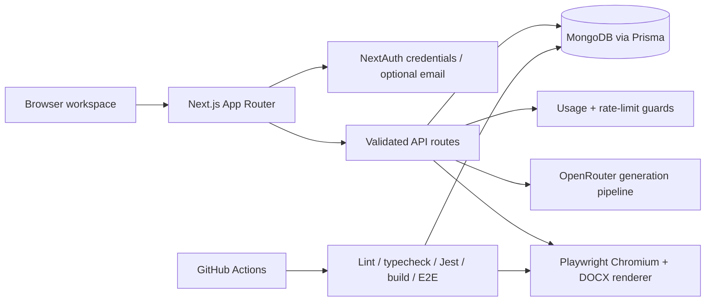

### PitchGenie

[](https://github.com/CodnanBaig/pitcheme/actions/workflows/ci.yml)

AI-powered pitch decks and proposals in minutes. PitchGenie helps founders, sales teams, and consultants generate compelling documents, export them to PDF/DOCX, and track usage—all with a clean Next.js 15 app router stack.

Production-readiness work is tracked in the release plan and baseline audit;
hosted provider integrations remain explicit deployment gates.

Current release notes and the explicit hosted-environment boundary are tracked
in [CHANGELOG.md](CHANGELOG.md).

The engineering story and verified release boundaries are summarized in the
[employer case study](docs/PitchGenie_Employer_Case_Study.md).


### Features

- **Auth with email + password** using NextAuth Credentials and Prisma
- **AI-assisted generation** of pitch decks and proposals via a pluggable AI service
- **Export** generated docs to PDF/DOCX
- **Stripe billing scaffold** (checkout, portal, and signed webhook routes are guarded and disabled by default until end-to-end verification)
- **Modern UI** built with Tailwind and Radix UI
- **Robust tests** with Jest (API, integration, performance, security)


### Tech Stack

- **Framework**: Next.js 15 (App Router), React 19, TypeScript
- **Runtime**: Node.js 20+ with pnpm 10.12.1
- **Auth**: NextAuth (Credentials), Prisma adapter
- **DB**: Prisma + MongoDB (local or hosted)
- **Styling**: Tailwind CSS, Radix UI primitives
- **Payments**: Stripe integration scaffold (explicitly disabled by default in the current release)
- **AI**: `ai` SDK with OpenAI provider (via `@ai-sdk/openai`)
- **Testing**: Jest, Testing Library, Supertest, MSW, Playwright, and axe accessibility smoke checks


### Project Structure

Key areas in the repository:

- `app/` — routes, API endpoints, and pages (App Router)
- `components/` — shared UI and feature components
- `lib/` — services, utilities, Prisma client, Stripe, auth helpers
- `prisma/` — Prisma schema and generated client configuration
- `__tests__/` — comprehensive test suites (API, integration, perf, security)


### Architecture

The production path keeps document ownership, generation accounting, and
export rendering on the server. The browser receives only the authenticated,
ownership-scoped result.



Key production decisions:

- MongoDB is the runtime datastore and must support replica-set transactions
  because Prisma uses transactions for writes; `pnpm db:deploy` synchronizes
  its schema and idempotently verifies/materializes its required indexes,
  including Stripe customer/subscription lookup indexes used by webhook
  reconciliation.
- AI output is normalized and validated before a document is persisted across
  standard, visual, and PDF pitch-deck paths; one bounded repair attempt and a
  controlled legacy fallback protect older model responses.
- OpenRouter model roles have reviewed defaults and bounded environment
  overrides, so provider model deprecations can be handled at deployment
  configuration time and then validated through the AI evaluation harness.
- Every generation records a request ID, model, prompt version, token count,
  duration, status, and bounded cost estimate without storing prompts or
  generated payloads in logs.
- Product telemetry persists bounded events for generation outcomes and safety
  blocks, exports, edits, version restores, and plan-limit reaches without
  storing prompts, generated content, credentials, or provider error text;
  telemetry failures never block user requests.
- API middleware propagates a bounded request ID across application and
  framework-owned routes, including authentication callbacks.
- JSON APIs and the signed Stripe webhook enforce route-specific byte caps while
  streaming request bodies; oversized requests fail with `413` before database,
  usage, or provider work.
- Registration keeps a friendly preflight lookup while handling a concurrent
  unique-email race as a safe conflict response.
- Document autosave uses ownership-scoped ETag revisions so stale browser tabs
  receive a recoverable conflict instead of silently replacing newer edits.
- Structured pitch-deck editing exposes slide titles, key points, visual
  direction, and speaker notes while preserving the existing raw editor for
  legacy documents.
- Generation forms use an opt-in server-sent event transport for provider
  deltas and validation/save stages; the underlying JSON routes remain the
  compatibility path for API clients.
- Owners can issue seven-day signed, read-only share links for proposals and
  pitch decks; shared rendering is sanitized, raw bearer tokens are never
  persisted, and owners can revoke links and review view counts.
- PDF export uses `playwright-core` and an explicit deployment Chromium path;
  the readiness probe can fail before traffic is enabled when that runtime is
  unavailable.
- Pitch-deck rendering keeps the enterprise navy/cloud/teal system in the
  viewer and export prompt paths; user brief values are treated as untrusted
  data by the generation instructions, request bodies are capped at 64 KB and
  32 nesting levels, high-confidence prompt-injection and unsafe-tooling
  requests are rejected before provider work, and model HTML is sanitized at
  the rendering boundary.
- The App Router error boundary provides a recoverable retry path and exposes
  only a bounded incident digest to the client log, never the exception text.
- Next.js framework-level request failures are captured with bounded request
  and route context; critical generation, export, auth, Stripe, profile,
  document, sharing, and version-history failures emit the same bounded
  operational event. Query strings, payloads, and exception messages stay out
  of operational logs.
- Dashboard data failures render an explicit degraded state with unavailable
  metrics rather than presenting zeroes as if they were real account data.
- The document workspace uses the same degraded-state contract and disables
  search/filter controls until its data source recovers.


### API Surface (selected)

- `app/api/auth/[...nextauth]/route.ts` — NextAuth handlers
- `app/api/auth/register/route.ts` — email/password registration
- `app/api/account/profile/route.ts` — authenticated profile updates
- `app/api/generate/pitch-deck/route.ts` — AI pitch deck generation
- `app/api/generate/proposal/route.ts` — AI proposal generation
- `app/api/generate/{proposal,pitch-deck}/stream/route.ts` — streamed generation deltas and stages
- `app/api/documents/*` — ownership-scoped document CRUD and version history
- `app/api/documents/[id]/share/route.ts` — owner-scoped share-link issuance, revocation, and view analytics
- `app/share/[token]/page.tsx` — sanitized, read-only public share rendering
- `app/api/export/pitch-deck/[id]/route.ts` — export pitch deck
- `app/api/export/proposal/[id]/route.ts` — export proposal
- `app/api/health/*` — liveness and dependency-aware readiness probes
- `app/api/telemetry/client-error/route.ts` — bounded production error-boundary telemetry
- `app/api/stripe/*` — guarded checkout, portal, and signed webhook routes (disabled unless explicitly enabled)


### Getting Started

1) Install dependencies

```bash
pnpm install --frozen-lockfile
```

2) Configure environment variables

Copy `.env.example` to `.env.local` and replace every required placeholder. The
application uses MongoDB in every environment; use a local MongoDB instance or
a hosted cluster such as MongoDB Atlas.

Docker is optional when a reachable hosted MongoDB cluster is supplied. In that
setup, `pnpm db:deploy`, the app, and the Playwright rehearsal connect directly
to Atlas. Docker is retained for the disposable local replica set, CI's
reproducible MongoDB/container smoke, and the production image path (including
the deployment Chromium runtime). Prisma requires a database name in the URI;
use an isolated name such as `pitchgenie-e2e` for browser rehearsals rather
than pointing tests at the application database.

```bash
# Required
DATABASE_URL="mongodb://127.0.0.1:27017/pitchgenie?replicaSet=rs0"
# Absolute http(s) URL; production deployments must use https://
NEXTAUTH_URL="http://localhost:3000"
NEXTAUTH_SECRET="replace-with-a-long-random-secret"
OPENROUTER_API_KEY="your-openrouter-key" # Optional when portfolio demo mode is enabled
PORTFOLIO_DEMO_MODE="false" # Set true for deterministic generation without an external provider
AI_COST_PER_MILLION_TOKENS="" # Optional blended paid-model rate per million tokens
APP_VERSION="0.1.0" # Local value; production must set the immutable release identifier
BUILD_SHA="" # Production commit when the platform does not provide one automatically
HEALTHCHECK_EXTERNAL_SERVICES="false" # Set true to probe provider APIs from readiness checks
HEALTHCHECK_MODEL_CATALOG="false" # Set true with external probes to verify configured model IDs
HEALTHCHECK_EXPORT_RUNTIME="false" # Set true to verify Chromium before advertising readiness
RATE_LIMIT_STORE="process" # Set mongodb for shared rate limits and usage reservations
HEALTHCHECK_DATABASE_INDEXES="false" # Set true to verify Prisma-managed Mongo indexes at readiness
CHROMIUM_EXECUTABLE_PATH="" # Optional deployment Chromium binary
ERROR_MONITORING_WEBHOOK_URL="" # Optional bounded error-monitoring endpoint
BRAND_LAB_ENABLED="false" # Keep internal visual-direction routes disabled in production

# Optional SMTP magic links
EMAIL_SERVER_HOST="smtp.example.com"
EMAIL_SERVER_PORT=587
EMAIL_SERVER_USER=""
EMAIL_SERVER_PASSWORD=""
EMAIL_FROM="noreply@example.com"

# Optional billing configuration (disabled unless the explicit flag is true)
STRIPE_BILLING_ENABLED="false"
STRIPE_SECRET_KEY=""
STRIPE_WEBHOOK_SECRET=""
STRIPE_PRO_PRICE_ID=""
STRIPE_ENTERPRISE_PRICE_ID=""
NEXT_PUBLIC_STRIPE_PUBLISHABLE_KEY=""
```

3) Initialize the database

```bash
pnpm db:generate
pnpm db:deploy
```

4) Run the dev server

```bash
pnpm dev
```

Open `http://localhost:3000` to use the app.


### Auth Model

- Email + password sign-up via `app/api/auth/register/route.ts`
- Session management via NextAuth; `credentials` provider is used for login
- Prisma stores hashed passwords with `bcryptjs`
- Credentials sign-in applies bounded email and trusted edge client-address
  guards outside tests; set `RATE_LIMIT_STORE=mongodb` for shared buckets in a
  multi-instance deployment.
- Registration applies both normalized client-address and email buckets so
  rotating a forwarded-address header cannot bypass the account-creation guard.
- Generation uses a bounded per-route bucket (10 requests/minute) plus a shared
  account-wide hourly bucket (20 attempts/hour) so switching between proposal
  and pitch-deck routes cannot bypass the expensive-generation guard. The
  account-wide guard also applies to paid plans with unlimited monthly usage.
- Subscription reads normalize unknown persisted plan/status values to a safe
  non-paid state until a verified billing event repairs the record.
- Subscription mutations persist the source Stripe event timestamp and ignore
  older deliveries, so webhook reordering cannot restore stale access.
- Billing synchronization ignores unknown add-ons but rejects subscriptions
  with multiple configured paid plans as ambiguous.
- Custom state-changing API requests enforce same-origin `Origin`/`Referer`
  checks; NextAuth callbacks and Stripe webhooks keep their provider-specific
  verification paths.
- Generation validation rejects high-confidence requests to create credential
  theft or malware tooling while preserving defensive security briefs; broader
  moderation remains a deployment/product policy decision.


### Scripts

```bash
pnpm dev                 # Run development server
pnpm build               # Build for production
pnpm start               # Start production server
pnpm lint                # Lint
pnpm quality:imports     # Runtime import graph audit
pnpm quality:secrets     # Deployable-code secret scan
pnpm quality:surface     # Runtime placeholder/dead-control audit
pnpm quality:telemetry   # API error-boundary telemetry audit
pnpm typecheck           # TypeScript check

# Testing
pnpm test                # All tests
pnpm test:watch          # Watch mode
pnpm test:coverage       # Coverage
pnpm test:api            # API tests
pnpm test:integration    # Integration tests
pnpm test:performance    # Performance tests
pnpm test:security       # Security-focused tests
pnpm exec playwright install chromium
pnpm test:e2e             # Chromium journeys, PDF/mobile smoke, quota/ownership checks, and desktop/mobile serious/critical axe checks
pnpm eval:ai              # Deterministic AI quality fixture harness
pnpm smoke:provider       # Opt-in real OpenRouter catalog + primary generation smoke

# Prisma
pnpm db:generate
pnpm db:deploy           # Schema sync plus idempotent MongoDB index bootstrap
pnpm db:migrate:versions # Dry-run-first version-history backfill
pnpm db:prune:expired    # Dry-run-first cleanup for expired auth/limit/telemetry records
pnpm verify:deployment  # Verify health, public pages, 404 surface, and release provenance
pnpm db:studio
```


### Testing Notes

- Tests are located under `__tests__/` with focused suites for API, security, integration, and performance
- Jest config: `jest.config.js`; setup: `jest.setup.js`
- AI quality fixtures and deterministic regression checks live in `evals/`; run `pnpm eval:ai` before changing prompt contracts.
- `pnpm smoke:provider` makes a real provider request and requires a valid
  `OPENROUTER_API_KEY`. It checks every configured model role in the provider
  catalog, then performs one minimal primary-model generation without printing
  the credential or provider response. Use `pnpm smoke:provider -- --all-models`
  to exercise every unique configured model before promoting a model change.


### Deployment

- Build with `pnpm build` and run with `pnpm start`
- A reproducible container path is available with `Dockerfile`; it installs the
  deployment Chromium runtime, prunes development dependencies from the runtime
  layer, sets the export readiness probe, and exposes a Docker healthcheck
  against `/api/health/ready`.
- Build and run the image with `docker build --build-arg APP_VERSION=<release> --build-arg BUILD_SHA=<commit> -t pitchgenie .` and
  `docker run --env-file .env.production -p 3000:3000 pitchgenie`. Supply the
  production MongoDB, auth, provider, and billing variables at runtime; the
  image uses a build-only placeholder environment during `next build`.
- Release builds must embed provenance with `--build-arg APP_VERSION=<release>`
  and `--build-arg BUILD_SHA=<commit>`; the readiness response exposes these
  sanitized values for rollout and rollback correlation and fails closed when
  either value is missing or unknown.
- Pushing a semver tag such as `v1.0.0` publishes a provenance- and
  SBOM-enabled image to GitHub Container Registry only after the full CI
  quality/build/container/browser smoke gate. The image still requires a
  separate platform rollout and hosted readiness check.
- For this image, set `CHROMIUM_EXECUTABLE_PATH=/usr/bin/chromium` in the
  production environment (or omit the variable); an empty env-file value
  would override the image default.
- `PUPPETEER_EXECUTABLE_PATH` remains a compatibility fallback for older
  deployments; use `CHROMIUM_EXECUTABLE_PATH` for new configuration.
- Configure environment variables (see `.env.example`) on your hosting provider
- Production builds require `DATABASE_URL`, an HTTPS `NEXTAUTH_URL`, a
  32-character `NEXTAUTH_SECRET`, and `OPENROUTER_API_KEY` unless
  `PORTFOLIO_DEMO_MODE=true`; the build fails fast when these are missing.
  Portfolio demo mode keeps proposal and pitch-deck creation functional with
  deterministic, input-aware output and does not contact an external provider.
  Production runtime readiness also requires an
  explicit `APP_VERSION` and build commit (`BUILD_SHA`, `GIT_COMMIT_SHA`, or
  `VERCEL_GIT_COMMIT_SHA`) so an uncorrelated image cannot receive traffic.
- Production runtime validation requires `RATE_LIMIT_STORE=mongodb`; the
  process-local store is intentionally limited to local development so
  multi-instance rate limits and usage reservations cannot silently diverge.
  If the configured MongoDB limiter is unavailable, request guards fail closed
  instead of falling back to independent per-instance buckets.
- Expired shared rate-limit buckets are pruned periodically so login and
  generation traffic does not create unbounded limiter storage.
- Generation records and product-event telemetry are retained for 180 days and
  are included in the same dry-run-first maintenance job, keeping operational
  storage bounded without deleting document content.
- Production runtime validation also requires
  `HEALTHCHECK_EXPORT_RUNTIME=true` and `HEALTHCHECK_DATABASE_INDEXES=true` so
  readiness verifies Chromium and the required MongoDB indexes before traffic
  is enabled.
- Production runtime validation also rejects standalone `mongodb://` URLs;
  use a hosted replica set or include `?replicaSet=<name>` in the connection
  string (MongoDB SRV URLs are accepted for hosted replica sets).
- Set `HEALTHCHECK_EXTERNAL_SERVICES=true` and
  `HEALTHCHECK_MODEL_CATALOG=true` in a provider-backed release when readiness
  should verify both provider reachability and configured model availability.
- Use a hosted MongoDB cluster and verify its network/IP allow-list before deployment
- Set `RATE_LIMIT_STORE=mongodb` in production or any multi-instance deployment. In
  that mode, generation usage is reserved with a conditional MongoDB update so
  concurrent requests cannot oversubscribe finite plans; failed generations
  release their reservation.
- PDF exports require a Chromium executable. The server uses `playwright-core`,
  so set `CHROMIUM_EXECUTABLE_PATH` to the deployment's Chromium binary and
  verify this in the target hosting environment.
- Generation, streaming, and PDF export handlers explicitly use the Node
  runtime and request a 60-second function budget for hosts that support route
  duration configuration. Provider retries, repairs, and model fallbacks share
  a 55-second request deadline; the host's plan limits remain a release check.
- Proposal PDF and DOCX exports preserve bounded Markdown tables, including
  pricing tables, with the enterprise export theme.
- Run `VERIFY_BASE_URL=https://your-domain.example VERIFY_BRAND_LAB_DISABLED=true EXPECTED_BUILD_SHA=<commit> pnpm verify:deployment` after deployment to validate live/readiness status,
  the public landing and pricing pages, the enterprise 404 surface, dependency
  statuses, runtime-environment validity, request correlation and security
  headers, cache policy, release provenance (including a non-unknown build
  version and commit), HTTPS transport, redirect-free health probes, and the
  enterprise-surface route gate.
- The current CI workflow validates install, the production dependency audit, Prisma generation, lint, typecheck, Jest, build, a production-server smoke test with Chromium export-runtime readiness and deployment verification, a production-container smoke against the CI MongoDB service (including dependency/security-header/provenance verification, `/api/health/ready`, and the Docker healthcheck), and the desktop/mobile Chromium + axe browser suite. CI uses a deterministic AI fixture and never calls the external provider.
- Dependabot opens weekly grouped updates for the pnpm dependency lockfile and
  GitHub Actions; review those changes through the same quality and deployment
  gates before promotion.
- Stripe checkout, portal, and webhook routes are guarded by `STRIPE_BILLING_ENABLED`; leave it false until test-mode checkout, portal, webhook delivery, and subscription synchronization have been verified
- Deployment sequencing, readiness probes, failure triage, and rollback are documented in [`docs/PRODUCTION_RUNBOOK.md`](docs/PRODUCTION_RUNBOOK.md)


### In Progress

- Ongoing improvements to the AI templates and exports
- Expanded test coverage and performance tuning
- UX refinements across generation flows


### License

Proprietary. All rights reserved unless otherwise noted.
